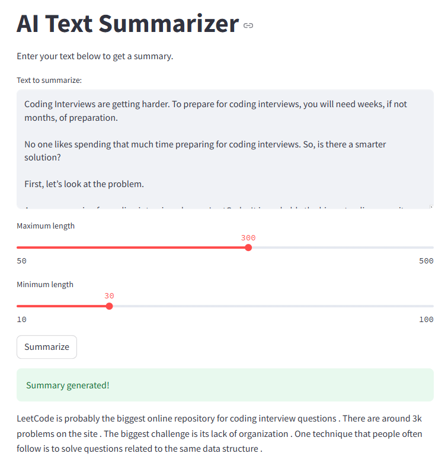

# AI Text Summarizer

A modern text summarization application built with FastAPI and Streamlit, powered by the DistilBART model. This application provides both a REST API and a user-friendly web interface for generating concise summaries of longer texts.



*Text Summarizer web interface powered by Streamlit*


## Features

- 🚀 FastAPI backend for efficient API processing
- 💻 Streamlit frontend for an intuitive user interface
- 🤖 Powered by the DistilBART-CNN model for high-quality summarization
- ⚡ Real-time text processing and summarization
- 🔧 Configurable summary length parameters
- 🧹 Intelligent text cleaning and validation

## Prerequisites

- Python 3.8 or higher
- pip (Python package manager)

## Installation

1. Clone the repository:
```bash
git clone <your-repo-url>
cd text_summarizer
```

2. Create a virtual environment (recommended):
```bash
python -m venv venv
source venv/bin/activate  # On Windows, use: venv\Scripts\activate
```

3. Install the required packages:
```bash
pip install -r requirements.txt
```

## Configuration

1. Create a `.env` file in the root directory:
```bash
cp .env.example .env
```

2. Configure your environment variables in `.env`:
```bash
API_HOST=0.0.0.0
API_PORT=5000
API_BASE_URL=http://localhost:5000
MODEL_NAME=sshleifer/distilbart-cnn-12-6
DEBUG=True
```

## Running the Application

### Starting the API Server

Run the FastAPI server using the provided script:

```bash
python run_api.py
```

The API will be available at your configured `API_BASE_URL`
- API documentation (Swagger UI): `http://localhost:5000/docs`
- Alternative API documentation (ReDoc): `http://localhost:5000/redoc`
- Health check endpoint: `http://localhost:5000/health`

### Starting the Web Interface

Run the Streamlit application in a separate terminal:

```bash
streamlit run app/streamlit_app.py
```

The web interface will be available at `http://localhost:8501`

## API Usage

### Endpoint: `/summarize`

**POST** `http://localhost:5000/summarize`

Request body:
```json
{
    "text": "Your long text to summarize goes here...",
    "max_length": 130,
    "min_length": 30
}
```

Response:
```json
{
    "summary": "Generated summary of the text..."
}
```

## Configuration

The summarizer can be configured with the following parameters:

- `max_length`: Maximum length of the generated summary (default: 130 tokens)
- `min_length`: Minimum length of the generated summary (default: 30 tokens)
- Text input must be at least 100 characters long

## Project Structure

```
text_summarizer/
├── app/
│   ├── main.py           # FastAPI application
│   ├── streamlit_app.py  # Streamlit web interface
│   ├── services/
│   │   └── summarizer.py # Text summarization logic
│   └── utils/
│       └── text_cleaner.py # Text preprocessing utilities
├── requirements.txt
└── README.md
```

## Model Details

The application uses the `sshleifer/distilbart-cnn-12-6` model, which is a distilled version of the BART model fine-tuned on CNN news articles. This model provides a good balance between performance and resource usage.

## Contributing

Contributions are welcome! Here's how you can contribute:

1. Fork the repository
2. Create your feature branch (`git checkout -b feature/AmazingFeature`)
3. Commit your changes (`git commit -m 'Add some AmazingFeature'`)
4. Push to the branch (`git push origin feature/AmazingFeature`)
5. Open a Pull Request

Please make sure to:
- Follow the existing code style
- Add tests if applicable
- Update documentation as needed

## License

This project is licensed under the MIT License - see the [LICENSE](LICENSE) file for details.

## Future Improvements

- Add support for multiple languages
- Implement batch processing for multiple texts
- Add more summarization models as options
- Include text analysis metrics
- Add caching for improved performance
- Implement user authentication
- Add summary quality metrics